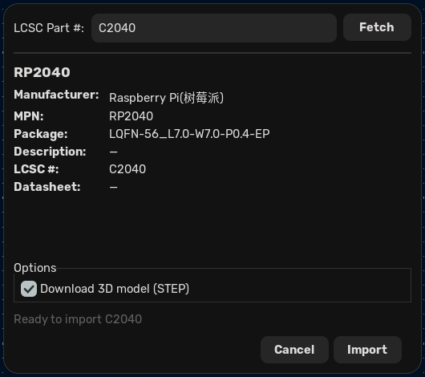

# JLCPCB Component Importer for KiCad

A KiCad plugin that imports components from the JLCPCB/LCSC parts library directly into your project, generating KiCad-native symbols, footprints, and 3D models.



## Features

- **One-click import** — Enter an LCSC part number (e.g. `C25804`) and the plugin fetches component data, generates the symbol and footprint, downloads the 3D STEP model, and registers everything in your project's library tables.
- **Symbol generation** — Converts EasyEDA symbol data to `.kicad_sym` format with correct pin mapping, graphics, and metadata.
- **Footprint generation** — Converts EasyEDA footprint data to `.kicad_mod` format, including pads, copper traces, silkscreen, courtyards, and fabrication layers.
- **3D model support** — Downloads STEP models from JLCPCB's CDN and attaches them to footprints with correct position and rotation.
- **Local caching** — SQLite-backed cache avoids redundant API calls for previously fetched components.
- **Library table management** — Automatically adds `sym-lib-table` and `fp-lib-table` entries to your KiCad project so imported parts are immediately available.

## Requirements

- **KiCad 8.0+** (tested on KiCad 9.0)
- **Python 3.10+** (uses KiCad's bundled Python; tested on 3.14)
- **`requests`** library (usually available in KiCad's Python environment)

## Installation

Clone this repository and run the install script:

```bash
git clone https://github.com/Ballistyxx/JLC2KiCad.git
cd JLC2KiCad
./install.sh
```

The script creates symlinks from KiCad's scripting plugins directory to this repository. It auto-detects your KiCad version, or you can specify one explicitly:

```bash
./install.sh 9.0
```

### Manual installation

If you prefer, create the symlinks yourself:

```bash
PLUGINS_DIR="$HOME/.local/share/kicad/9.0/scripting/plugins"
mkdir -p "$PLUGINS_DIR"
ln -s "$(pwd)/jlcpcb_importer" "$PLUGINS_DIR/jlcpcb_importer"
ln -s "$(pwd)/vendor"          "$PLUGINS_DIR/vendor"
```

Restart KiCad after installing.

### Uninstall

```bash
rm ~/.local/share/kicad/9.0/scripting/plugins/jlcpcb_importer
rm ~/.local/share/kicad/9.0/scripting/plugins/vendor
```

## Usage

1. Open KiCad and launch the **PCB Editor** (pcbnew).
2. Find **JLCPCB Component Importer** in the toolbar or under **Tools > External Plugins**.
3. Enter an LCSC part number (e.g. `C25804`) and click **Fetch**.
4. Review the component details in the preview panel.
5. Check or uncheck **Download 3D model (STEP)** as desired.
6. Click **Import**.

The symbol, footprint, and 3D model are written to a `jlcpcb_lib/` directory inside your KiCad project, and the library tables are updated automatically. You can immediately place the component from the `jlcpcb_parts` symbol library.

## Conversion Examples

These examples show the EasyEDA-to-KiCad conversion quality (from the original JLC2KiCadLib project):

EasyEDA source | KiCad result
---- | ----
 | 
 | 
 | 

## Project Structure

```
JLC2KiCad/
├── jlcpcb_importer/          # The KiCad plugin
│   ├── plugin.py             # ActionPlugin entry point
│   ├── api/                  # JLCPCB/EasyEDA API client & cache
│   ├── generators/           # Symbol, footprint, and 3D model generators
│   ├── library/              # Library path management & table editing
│   ├── ui/                   # wxPython import dialog
│   └── utils/                # Config, logging
├── vendor/                   # Vendored KicadModTree (footprint generation)
├── JLC2KiCadLib/             # Original CLI tool (preserved for reference)
├── install.sh                # Plugin installer
└── images/                   # Screenshots and examples
```

## Attribution

This project is a fork of [JLC2KiCad_lib](https://github.com/TousstNicolas/JLC2KiCad_lib) by **TousstNicolas**, which provides a command-line tool for generating KiCad libraries from JLCPCB/EasyEDA components. The symbol and footprint conversion logic in this plugin is derived from that work.

The footprint generator uses a vendored copy of [KicadModTree](https://gitlab.com/kicad/libraries/kicad-footprint-generator) with modifications for Python 3.13+ compatibility (removal of the `lib2to3`-dependent `future` package).

## License

MIT License -- see [LICENSE](LICENSE) for details.

Original copyright (c) 2021 TousstNicolas.
